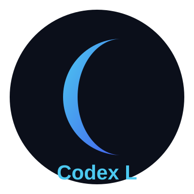

<p align="center">
  
</p>

<h1 align="center">Codex l</h1>

<p align="center">
Next-Generation 3D Creation Engine<br>
Modern • Cinematic • Modular • Powerful
</p>

<p align="center">


</p>

---

# 🌌 About Codex l

Codex l is a modern open-source 3D creation and animation engine  
inspired by professional tools like Blender,  
but redesigned with a futuristic modular architecture.

It is built for:

• 3D Artists  
• Game Developers  
• Technical Creators  
• Visual Designers  
• Experimental Developers  

Codex l combines performance, flexibility and cinematic visual effects in a clean and scalable engine design.

---

# 🎬 Core Features

## 🧱 3D Scene System
- Scene Graph architecture
- Object hierarchy
- Transform system (Position, Rotation, Scale)
- Camera management

## 🎞 Advanced Animation Engine
- Timeline editor
- Keyframe system
- Curve interpolation
- Rigging support
- Skeletal animation (planned)

## ✨ Visual Effects Engine
- Particle system
- Shader system
- Dynamic lighting
- Post-processing effects
- Bloom, Motion Blur (planned)
- Real-time effects pipeline

## 🎥 Rendering
- Real-time renderer
- Modular rendering pipeline
- Future GPU acceleration support
- Ray tracing (roadmap)

---

# 🏗 Engine Architecture

Codex l follows a layered modular architecture:

Core Layer  
→ Scene, Objects, Camera, Renderer  

Animation Layer  
→ Timeline, Keyframes, Rigging  

Effects Layer  
→ Particles, Shaders, Lighting, PostFX  

UI Layer  
→ Editor Panels, Tools, Extensions  

Utility Layer  
→ Math3D, Helpers, Optimization  

Designed for:

✔ Scalability  
✔ Clean code separation  
✔ Extension support  
✔ Future plugin marketplace  

---

# 🚀 Installation

Clone repository:

```bash
git clone https://github.com/yourname/Codex-l
cd Codex-l
